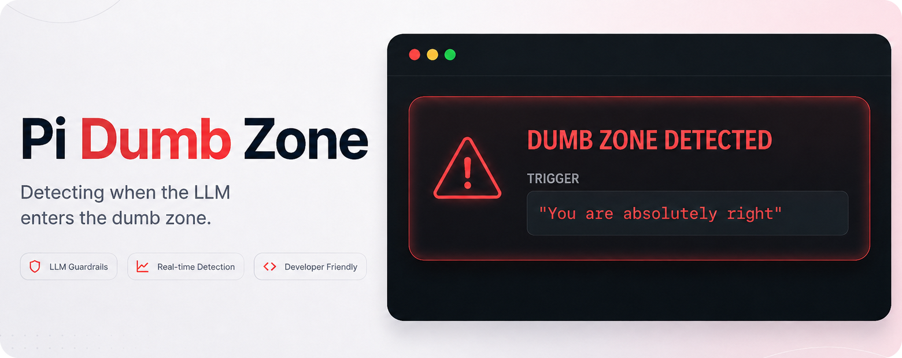

# Context Engineering

Have you ever found yourself deep into a conversation with a language model, pushed back on one of its answers, and received something along the lines of:

> "You are absolutely right."

Or:

> "You are right to question that."

For a moment, you might think you have outsmarted the language model. Maybe you have. But it might also be a sign that the conversation has started to drift and the model is struggling with the context you have built up.

The longer the conversation gets, the more information the model has to work with: your original instructions, previous answers, corrections, abandoned ideas, tool results, searches, and assumptions that may no longer be relevant.

And that is where context engineering becomes important.

## Context Is a Budget

When we talk about LLMs, we often talk about prompt engineering: how to write the perfect prompt.

Context engineering is a broader idea. It is about deciding what information the model should have available when answering your question.

Even before you write your first message, an application may already provide the model with context. There can be system instructions telling it how to behave, information about available tools, skills, or other application-specific instructions.

For developers working with coding agents, even more information can enter the context as the agent works. Web searches, files, tool calls, MCP servers, documentation, command output, and previous reasoning can all add information.

It is tempting to think that giving the model as much information as possible will make it smarter.

But context is a budget, not a target. Modern models can have very large context windows. But the maximum context window and the amount of context a model can effectively reason over are not necessarily the same thing.

The important question isn't:

**"How much can I fit into the context window?"**

It is:

**"What actually deserves to be in the context window for the task I am trying to solve right now?"**

## An Example

This becomes especially noticeable when you have been working with an LLM for a while.

You start with one approach. It doesn't work.

You correct the model.

It tries something else.

You change direction.

It makes an assumption that you correct.

Twenty messages later, you might finally know exactly what you want — but the model is still sitting there with the history of how you got there.

For a human conversation, we have more than the literal words being spoken. We use tone, emphasis, body language, and our understanding of the conversation to figure out what matters.

An LLM does not have that same understanding of importance. If something is important, we need to make that importance clear through the context we give it.

Sometimes the best context engineering technique is therefore surprisingly simple:

**Start a new session.**

Think of it like a whiteboard. After an hour of discussing different approaches, crossing things out and changing direction, you might understand the problem much better than when you started.

Instead of continuing to write in the tiny remaining spaces on the whiteboard, clean the whole board and write down the few things you now know actually matter.

## Keep What Matters

Starting a new session doesn't mean throwing away everything you have learned.

Before starting over, ask the model to summarize the important findings, decisions, constraints, and remaining questions.

Then read that summary yourself.

This part matters.

Summaries are lossy. Something that was important to you might not be what the model considers important enough to preserve. Check numbers, decisions, definitions, constraints, and anything else that would materially change the next session.

Then start a fresh session with the information you actually need.

Some applications and coding agents also perform automatic context compaction as conversations grow. Exactly how this works depends on the application, and you should not necessarily assume that automatic compaction will preserve the same information that *you* consider important.

Sometimes manually deciding what carries forward is the better option.

That is context engineering too.

## A Practical Habit

You don't need to understand tokenizers, attention mechanisms, or model architecture to manage context better.

A few simple habits go a long way:

- Start a session with a clear goal.
- Make important constraints explicit.
- Don't add information just because you have it.
- When the task changes significantly, consider starting a new session.
- If you have spent several messages correcting the model, consider whether starting fresh would be easier.
- Before resetting, summarize what matters and review the summary yourself.
- Don't paste an entire old conversation into a new one when five bullet points would do.

And perhaps, if you find yourself arguing with the model more than actually getting work done, that is a pretty good sign that it might be time for a reset.

## The Dumb Zone

And this brings us back to:

> "You are absolutely right."

Obviously, that phrase does not scientifically prove that your context has gone bad. Models can be agreeable for many reasons, and excessive agreement itself is a known behavior often discussed as **sycophancy**.

But after seeing the phrase one too many times during long coding sessions, and hearing it explained by Dex Horthy on [The Pragmatic Engineer](https://newsletter.pragmaticengineer.com/p/context-engineering-with-dex-horthy), I thought it would be funny to treat it as a warning sign.

That became [**pi-dumb-zone**](https://github.com/ingin97/pi-dumb-zone), a small extension I made for Pi that watches for suspiciously agreeable phrases and warns you that perhaps — just perhaps — it is time to look at your context.

It is mostly a joke.

But the problem behind the joke isn't.

Context engineering isn't only something people building AI agents need to think about. Every time you decide to start a new conversation, remove irrelevant information, summarize an old session, or explicitly tell a model what matters, you are doing context engineering.

The goal isn't to give the model everything you know.

It is to give it what it needs right now.

## Further reading

- [Effective Context Engineering for AI Agents](https://www.anthropic.com/engineering/effective-context-engineering-for-ai-agents) — Anthropic
- [Lost in the Middle: How Language Models Use Long Contexts](https://arxiv.org/abs/2307.03172)
- [Expanding on what we missed with sycophancy](https://openai.com/index/expanding-on-sycophancy/) — OpenAI
