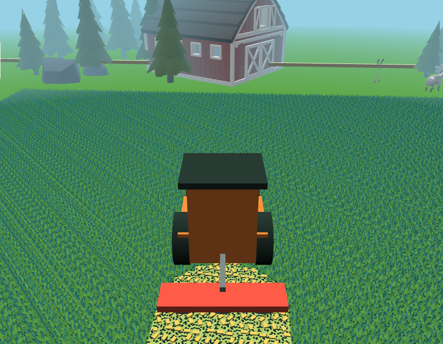
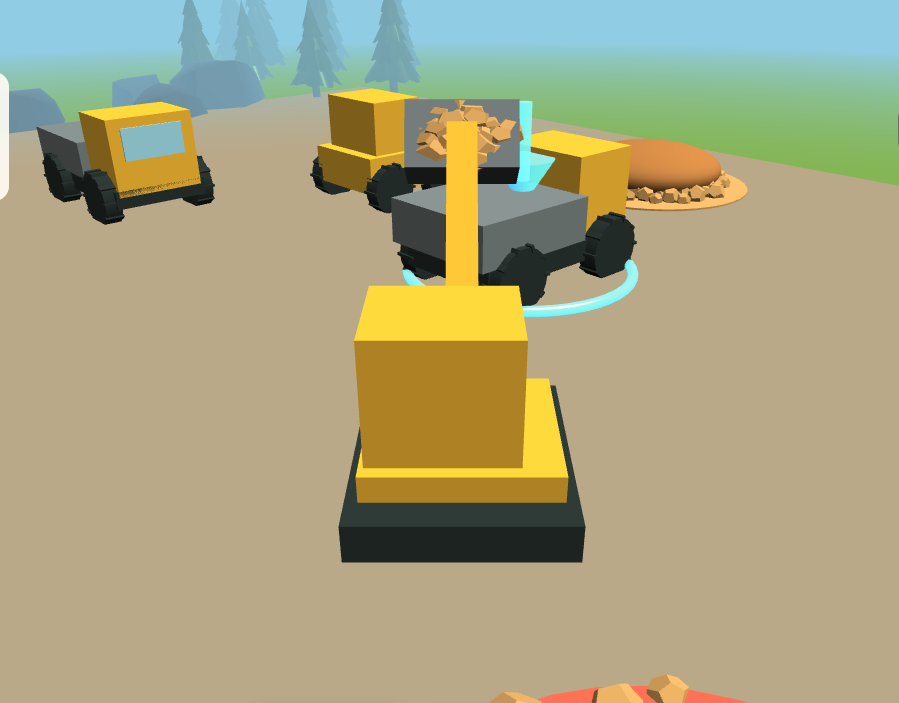

# Little Machines

This summer, we spent some time at my in-laws'. One of my toddler's favourite activities was helping Grandpa mow the lawn with the lawn tractor. Even though he recently bought a robotic lawn mower, my toddler asked almost every day to go out and cut the grass.

He became surprisingly good at steering. There were no serious accidents, although I think a flower bed may have had a close call once.

After the summer, a couple of weeks ago, I remembered the old Logitech steering wheel for my PlayStation 2 that had been lying around. I wondered how difficult it would be, with today's coding agents, to make a small game where he could drive around and mow a lawn himself.

My first thought was Unity, but I wanted to see what was available for web games first and whether a browser game could receive input from the wheel and pedals. It actually could, so I ended up using [Babylon.js](https://www.babylonjs.com/).

## Connect the wheel

The first version was only a debug application. I wanted to know whether the browser could see the wheel and pedals at all.

It worked rather well out of the box. The one small catch was that the pedals reported their input backwards, so I had to reverse them. After that, I had a working steering wheel and pedals in a web application.

That was enough to make something more interesting.

## Tractor

Since tractors are also fun to watch, I started with a tractor rather than a lawn tractor. It was entertaining to drive it around a square box, but it needed an objective.

So I added tiles that were supposed to be grass. Drive over a tile and it disappears, as if it has been cut.

That immediately made it feel more like a game. Then I found some CC0 assets for grass, backgrounds, and the rest of the environment, and the little prototype started to look like a place worth driving around in.

Mowing turned into raking. Raking turned into baling. Before long, there were different machines for each job and a tiny farming-simulator-like loop.

I also realised that handling both pedals was probably a bit much for a toddler, so I added an auto-drive mode.

Mowing grass in the farming mode.

## Additional machines

Then I started thinking about other machines that my toddler would like to drive around. That became a second mode: a construction site with an excavator, dumper, and wheel loader, each with simple tasks to do.

It is a small project, but it was a particularly fun way to turn an old piece of hardware into something new and to see how quickly an idea can become a playable little game with coding agents helping along the way.

_The construction-site mode._

If you have an old steering wheel from your younger gaming days lying around and a toddler who loves machines, give it a try:

[Play Little Machines](https://machines.ingebrigtnygard.com)

The code is available on [GitHub](https://github.com/ingin97/little-machines).
